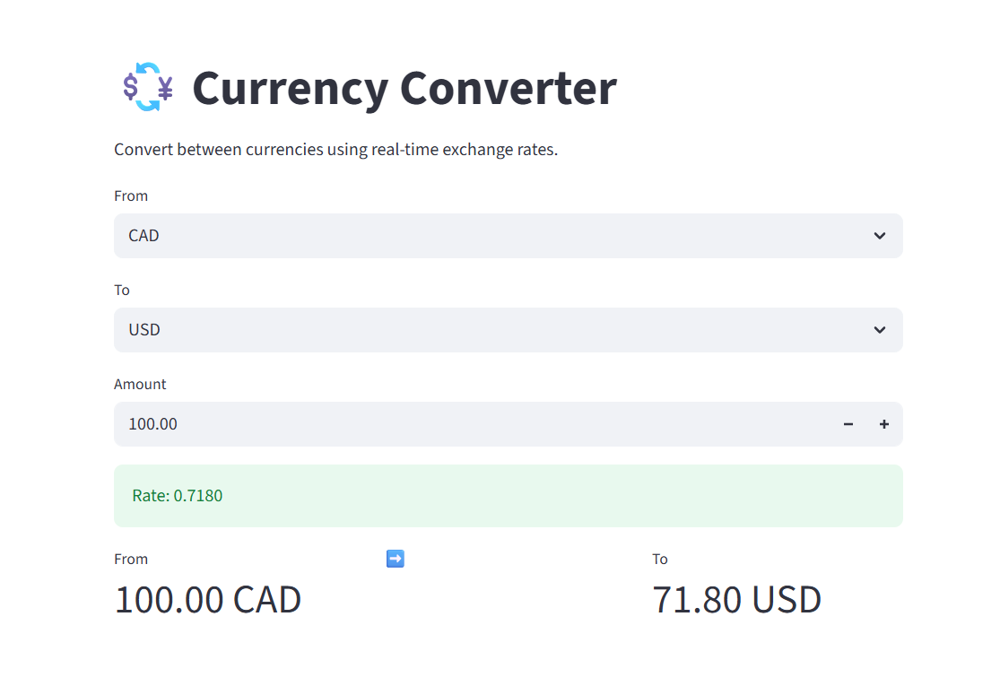

# 💱 Currency Converter

A simple and modern **currency converter web app** built with Python and Streamlit that uses real-time exchange rates.

---

##  Demo


Convert any supported currency instantly using live market data.

---

##  Features

* Real-time exchange rates
*  Convert between 20+ currencies
*  Fast API requests with caching (3 hours TTL)
*  Simple and clean UI with Streamlit
*  Automatic updates on input change
*  Modular and scalable code structure

---

##  Project Structure

```text
currency-converter/
│
├── app.py
├── requirements.txt
├── README.md
│
├── assets/
│       ├── demo.png
│       
└── src/
    ├── api.py            # Handles API requests
    ├── converter.py      # Currency conversion logic
    ├── constants.py      # Currency list
    ├── config.py        # Config and settings
    ├── utils.py         # Helper functions
    └── __init__.py
```

---

##  How It Works

1. User selects base and target currencies
2. Enters an amount
3. App fetches live exchange rate from API
4. Result is calculated and displayed instantly

The API responses are cached for 3 hours to reduce network calls and improve performance.

---

##  Installation

Clone the repository:

```bash
git clone https://github.com/your-username/currency-converter.git
cd currency-converter
```

Install dependencies:

```bash
pip install -r requirements.txt
```

---

##  Run the App

```bash
streamlit run app.py
```

---

##  License

This project is open-source and available under the MIT License.

---

##  Author

Built as a learning project for improving Python, API handling, and Streamlit UI development.
